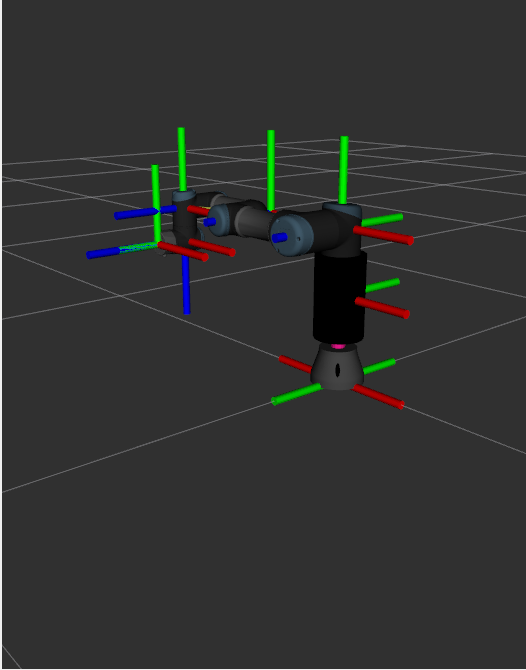
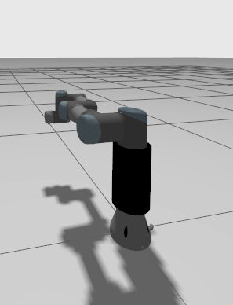
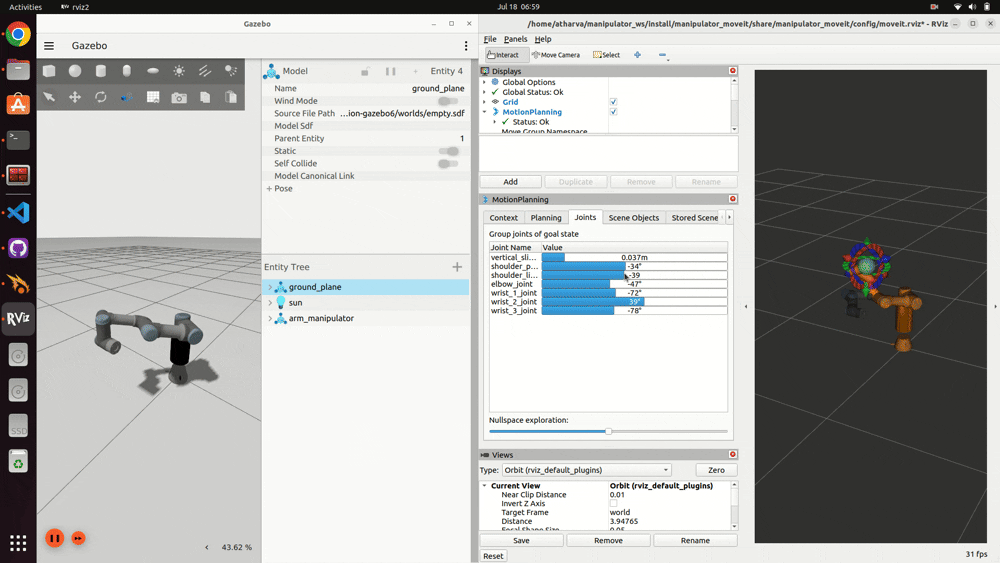
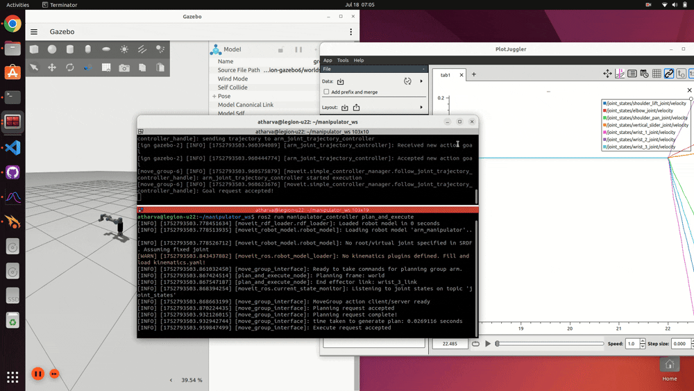
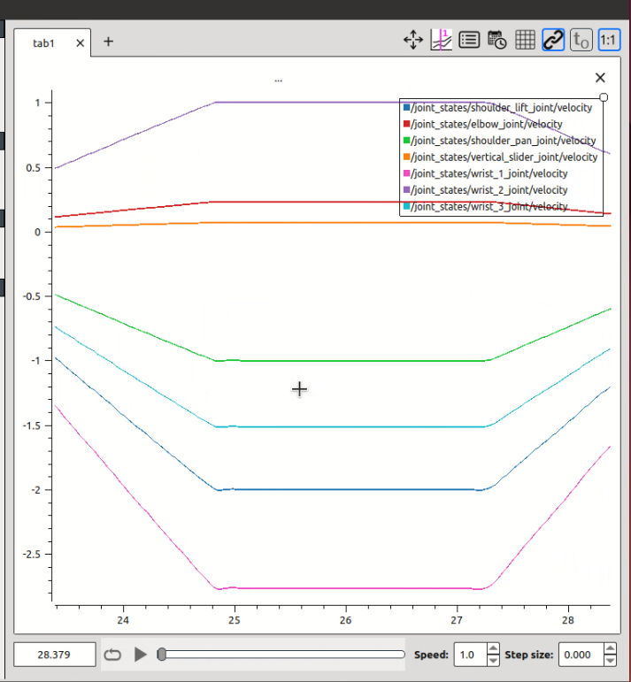

# Universal Robots Manipulator

## System

## Robotic Arm

Robot Specs: UR3e Robot. The URDF was modified and a vertical slider joint was added.







## Gazebo Setup, Simulation, and, Trajectory planning using Moveit

Modified URDF configured properly and interfaced with gazebo and moveit successfully.
Full Video Link: 




To run the gazebo simulation, launch the controllers, and the movegroup interface
```bash
# source your workspace
ros2 launch manipulator_bringup simulation.launch.py use_sim_time:=true
```

To plan and execute trajectories using Moveit's rviz GUI
```bash
# source your workspace
ros2 launch manipulator_moveit moveit_rviz.launch.py
```

## Custom Goal, trajectory planning, and velocities profiles

In this C++ node, two target goal poses were set and a trajectory was generated from home position to Pose_1 and subsequently to Pose_2. Time Parameterization was added between the trajectory points to obatin trapezoidal velocity profiles.
Full Video Link:






To run this test example
```bash
# source your workspace and launch the gazebo simulation
ros2 launch manipulator_bringup simulation.launch.py use_sim_time:=true
`
# Launch the Plan and Execute Node
ros2 run manipulator_controller plan_and_execute
``` 

## Waypoint definition and Cartesian Motion

In this C++ node, a set of 8 predefined points were used to simulate small movements along the X-Y plane. The manipulator carried out the movements, adjusting it's vertical slider whenever necessary. Once again, time parameterized trajectories were used to obtain trapezoidal velocity profiles, but the results were not as sharp and good for smaller trajectories.


To run this test example
```bash
# source your workspace and launch the gazebo simulation
ros2 launch manipulator_bringup simulation.launch.py use_sim_time:=true
`
# Launch the Plan and Execute Node
ros2 run manipulator_controller waypoint_following
``` 

**Possible solutions:**


 
